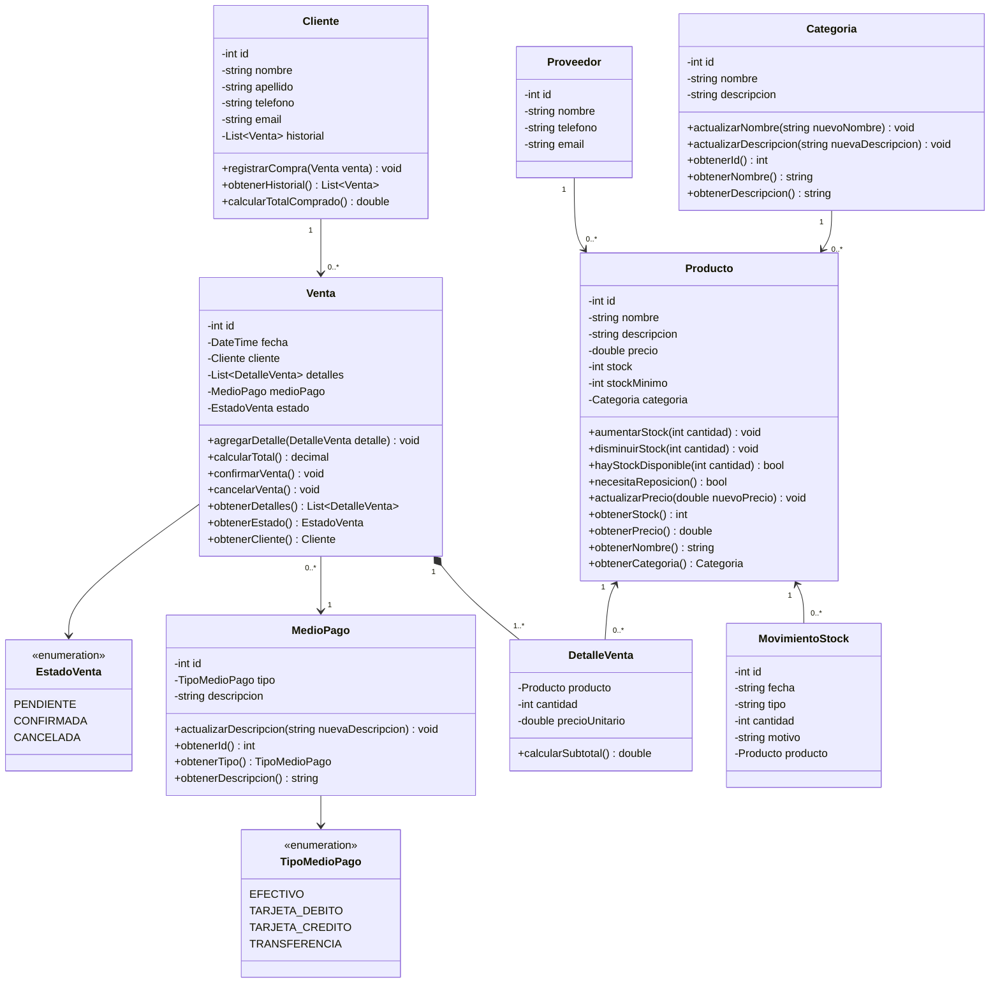

# Diagrama de Clases del Dominio

```mermaid
classDiagram
    class Categoria {
        -int id
        -string nombre
        -string descripcion
        +actualizarNombre(string nuevoNombre) void
        +actualizarDescripcion(string nuevaDescripcion) void
        +obtenerId() int
        +obtenerNombre() string
        +obtenerDescripcion() string
    }

    class Proveedor {
        -int id
        -string nombre
        -string telefono
        -string email
    }

    class Cliente {
        -int id
        -string nombre
        -string apellido
        -string telefono
        -string email
        -List~Venta~ historial
        +registrarCompra(Venta venta) void
        +obtenerHistorial() List~Venta~
        +calcularTotalComprado() double
    }

    class Producto {
        -int id
        -string nombre
        -string descripcion
        -double precio
        -int stock
        -int stockMinimo
        -Categoria categoria
        +aumentarStock(int cantidad) void
        +disminuirStock(int cantidad) void
        +hayStockDisponible(int cantidad) bool
        +necesitaReposicion() bool
        +actualizarPrecio(double nuevoPrecio) void
        +obtenerStock() int
        +obtenerPrecio() double
        +obtenerNombre() string
        +obtenerCategoria() Categoria
    }

    class TipoMedioPago {
        <<enumeration>>
        EFECTIVO
        TARJETA_DEBITO
        TARJETA_CREDITO
        TRANSFERENCIA
    }

    class EstadoVenta {
        <<enumeration>>
        PENDIENTE
        CONFIRMADA
        CANCELADA
    }

    class MedioPago {
        -int id
        -TipoMedioPago tipo
        -string descripcion
        +actualizarDescripcion(string nuevaDescripcion) void
        +obtenerId() int
        +obtenerTipo() TipoMedioPago
        +obtenerDescripcion() string
    }

    class Venta {
        -int id
        -DateTime fecha
        -Cliente cliente
        -List~DetalleVenta~ detalles
        -MedioPago medioPago
        -EstadoVenta estado
        +agregarDetalle(DetalleVenta detalle) void
        +calcularTotal() decimal
        +confirmarVenta() void
        +cancelarVenta() void
        +obtenerDetalles() List~DetalleVenta~
        +obtenerEstado() EstadoVenta
        +obtenerCliente() Cliente
    }

    class DetalleVenta {
        -Producto producto
        -int cantidad
        -double precioUnitario
        +calcularSubtotal() double
    }

    class MovimientoStock {
        -int id
        -string fecha
        -string tipo
        -int cantidad
        -string motivo
        -Producto producto
    }

    Categoria "1" --> "0..*" Producto
    Proveedor "1" --> "0..*" Producto
    Cliente "1" --> "0..*" Venta
    Producto "1" <-- "0..*" DetalleVenta
    Producto "1" <-- "0..*" MovimientoStock
    Venta "1" *-- "1..*" DetalleVenta
    Venta "0..*" --> "1" MedioPago
    MedioPago --> TipoMedioPago
    Venta --> EstadoVenta
```